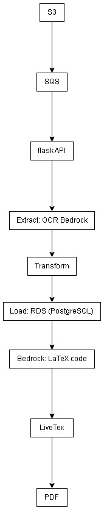

# AI-Powered ETL Pipeline for Invoice Analysis

Automated ETL pipeline that extracts structured data from invoice images using AI, processes it, and generates executive reports. Built as a technical demonstration of cloud services integration, AI APIs, and modern data engineering practices.

## Technologies & Tools

### Cloud Services (AWS)
- **Amazon S3** - Object storage for invoice images
- **Amazon Bedrock** - AI/ML service for document understanding
  - Nova Lite v1:0 - Multimodal model for text extraction
  - Nova Pro v1:0 - Advanced model for report generation
- **Amazon RDS PostgreSQL** - Managed relational database
- **Amazon SQS** - Message queue for event-driven processing

### AI & Machine Learning
- **Amazon Bedrock Converse API** - Structured multimodal inference
- **Vision-Language Models** - Image-to-text extraction
- **Generative AI** - Automated LaTeX report generation
- **Prompt Engineering** - Optimized prompts for consistent JSON output

### Backend & Infrastructure
- **Python 3.11** - Core programming language
- **Flask** - RESTful API and web server
- **Docker & Docker Compose** - Containerization and orchestration
- **PostgreSQL** - Relational database with SSL connections
- **LaTeX (pdflatex)** - Professional document generation

### Python Libraries
```
boto3              # AWS SDK for Python
psycopg2-binary    # PostgreSQL adapter
flask              # Web framework
python-dotenv      # Environment variable management
```

### Architecture Pattern
- **ETL Pipeline** - Extract, Transform, Load
- **Event-Driven** - S3 triggers → SQS → Processing
- **Microservices** - Modular, single-responsibility components
- **REST API** - HTTP endpoints for manual triggering

## System Architecture



## Pipeline Stages

### 1. Extract (`src/Extract/Extract.py`)

**Technology Stack:**
- Boto3 S3 client for object retrieval
- Boto3 Bedrock Runtime client for AI inference
- Base64 encoding for image transmission
- JSON parsing with error handling

**Implementation:**
```python
# Key features demonstrated:
- AWS SDK integration (boto3)
- Multimodal AI model interaction
- Image preprocessing (base64 encoding)
- Structured prompt engineering for JSON output
- Robust JSON extraction from LLM responses
- Error handling and recovery
```

**AI Prompt Design:**
Engineered prompts to extract:
- Document metadata (ID, name, description)
- Line items with quantities and prices
- Handles variations in invoice formats
- Returns structured JSON for downstream processing

### 2. Transform (`src/Transform/Transform.py`)

**Technology Stack:**
- Python Decimal for precise financial calculations
- Regular expressions for text normalization
- Schema validation and mapping

**Data Quality Features:**
```python
# Demonstrated skills:
- Data normalization and cleaning
- Type conversion with error handling
- Schema enforcement
- Default value handling
- Field name mapping (flexible input handling)
- Financial data precision (Decimal type)
```

### 3. Load (`src/Load/Load.py`)

**Technology Stack:**
- PostgreSQL with psycopg2
- SSL/TLS connections
- Transactional operations

**Database Design:**
```sql
-- Normalized schema with referential integrity
documents (id, filename, document_id, name, description)
line_items (id, document_id, item, quantity, unit_price, total)
```

**Features:**
- Incremental loading (upsert logic)
- Foreign key relationships
- ACID transactions
- Automatic table creation
- Connection pooling ready

### 4. Analyze (`src/Analyze/Analyze.py`)

**Technology Stack:**
- Amazon Bedrock for AI report generation
- LaTeX for professional document formatting
- Subprocess management for PDF compilation

**AI-Powered Analytics:**
```python
# Advanced features:
- SQL data aggregation
- AI-driven report generation
- LaTeX template creation via LLM
- Automated PDF compilation
- File system management
- Error handling for compilation failures
```

## Quick Start

### Prerequisites Setup

1. **AWS Configuration**
```bash
# Required AWS services:
- S3 bucket with JPG invoice images
- RDS PostgreSQL instance
- SQS queue with S3 event notifications
- Bedrock access (us-east-1 region)
```

2. **Environment Variables** (`.env` file)
```env
AWS_ACCESS_KEY_ID=your_key
AWS_SECRET_ACCESS_KEY=your_secret
AWS_DEFAULT_REGION=us-east-1

SQS_QUEUE_URL=https://sqs.us-east-1.amazonaws.com/.../alvorada-etl-queue

RDS_HOST=your-instance.rds.amazonaws.com
RDS_DATABASE=postgres
RDS_USER=admin
RDS_PASSWORD=your_password
RDS_PORT=5432
```

### Running with Docker

```bash
# Build and run
docker-compose up --build

# The application will:
# 1. Start Flask server on port 5000
# 2. Poll SQS for new file events
# 3. Process images automatically
# 4. Generate reports in reports/
```

### Manual Execution

Access the web interface in your browser:

```bash
# Home page with navigation
http://localhost:5000/

# Health check page
http://localhost:5000/health

# Trigger ETL page
http://localhost:5000/trigger
```

Or use curl for API calls:

```bash
# Trigger ETL manually
curl -X POST http://localhost:5000/trigger

# Health check
curl http://localhost:5000/health
```

## API Endpoints

| Endpoint | Method | Description |
|----------|--------|-------------|
| `/health` | GET | Health check endpoint |
| `/trigger` | POST | Manual ETL trigger for test images |

## Project Structure

```
ETL_docker/
├── app.py                      # Flask app + SQS polling + orchestration
├── src/
│   ├── Extract/
│   │   └── Extract.py          # S3 + Bedrock AI extraction
│   ├── Transform/
│   │   └── Transform.py        # Data cleaning & normalization
│   ├── Load/
│   │   └── Load.py             # PostgreSQL incremental loading
│   └── Analyze/
│       └── Analyze.py          # AI report generation + LaTeX compilation
├── reports/                    # Generated LaTeX and PDF files
├── Dockerfile                  # Python 3.11 + TexLive
├── docker-compose.yml          # Service orchestration
├── requirements.txt            # Python dependencies
└── .env                        # Configuration (not in git)
```

## Key Technical Achievements

### Cloud Integration
- Multi-service AWS architecture
- Event-driven processing with SQS
- Secure credential management
- SSL database connections

### AI/ML Implementation
- Multimodal AI model integration (vision + language)
- Prompt engineering for structured outputs
- Two-stage AI pipeline (extraction + analysis)
- Handling non-deterministic LLM responses

### Data Engineering
- ETL pipeline design and implementation
- Data normalization and validation
- Incremental loading strategies
- Relational database schema design

### DevOps & Best Practices
- Containerized deployment
- Environment-based configuration
- Error handling and logging
- Modular, testable code architecture
- Security best practices (SSL, .gitignore)

## Output Examples

### Database Records
```sql
-- Structured data ready for analytics
SELECT d.name, SUM(l.total) as total_value
FROM documents d
JOIN line_items l ON d.id = l.document_id
GROUP BY d.name
ORDER BY total_value DESC;
```

### Generated Reports
- `reports/report.tex` - LaTeX source
- `reports/report.pdf` - Executive summary with:
  - Document counts and totals
  - Top suppliers by spend
  - Most common line items
  - Professional formatting

## Technical Decisions

**Why Amazon Bedrock?**
- Managed AI service (no model training/hosting)
- Multimodal capabilities (image + text)
- Multiple model options (Lite for extraction, Pro for analysis)
- Pay-per-use pricing

**Why PostgreSQL?**
- Relational data with foreign keys
- ACID compliance for financial data
- Wide AWS RDS support
- Strong Python ecosystem (psycopg2)

**Why Docker?**
- Consistent environments
- Easy LaTeX installation
- Simplified deployment
- Resource management

**Why Event-Driven (SQS)?**
- Decouples upload from processing
- Automatic retry on failure
- Scalable architecture
- No polling S3 directly

## Skills Demonstrated

- Cloud architecture design (AWS)
- AI/ML API integration (Bedrock)
- ETL pipeline development
- Database design and management
- REST API development (Flask)
- Containerization (Docker)
- Event-driven architectures
- Python best practices
- Document processing automation
- Error handling and recovery
- Security best practices

## Future Enhancements

- Add Celery for distributed task processing
- Implement CloudWatch metrics and alarms
- Add unit and integration tests
- Support multiple document formats (PDF, PNG)
- Add data validation rules engine
- Implement API authentication
- Add frontend dashboard
- Support batch processing
- Add cost optimization (S3 lifecycle policies)
- Implement CI/CD pipeline
